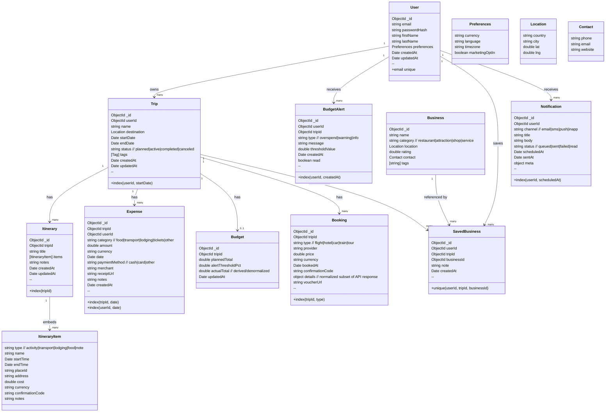
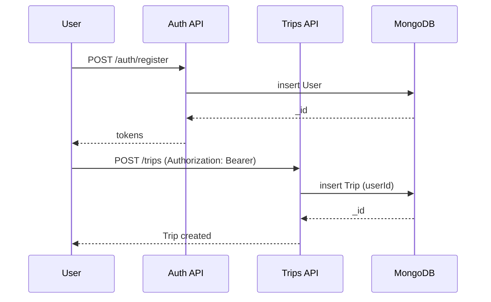
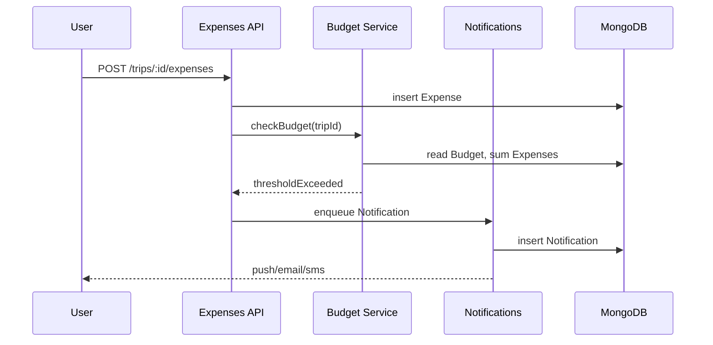

# TravelWise Backend — Project Requirements Document (PRD)

> **Stack**: Node.js, Express, MongoDB (Atlas), JWT Auth  
> **Scope**: Backend APIs, data model, integrations, and system interactions for the TravelWise app.

---

## 1. Overview

### 1.1 Purpose
Define backend requirements, data model, interfaces, and constraints to support TravelWise features: user auth, trips & itineraries, expenses & budgets, bookings, recommendations, local businesses, and notifications.

### 1.2 Goals & Success Criteria
- **G1**: Provide secure REST APIs for all core features.
- **G2**: Average API latency < **500 ms**, p95 < **1.2 s** under 5k concurrent users.
- **G3**: 99.9% monthly uptime; automated backups & restore drills.
- **G4**: Clear ERD and relationships enabling consistent implementation & testing.

### 1.3 Stakeholders
- **Product**: PRD ownership & prioritization
- **Backend Team**: API & data implementation
- **Frontend/Mobile**: API consumers
- **QA**: Test plans & automation
- **Ops/SRE**: CI/CD, observability, scaling

### 1.4 Out of Scope (Phase 1)
- Native offline sync
- Direct bank connections; PSD2/OFX
- Multi-currency wallets with FX rates (can store currency per item)

---

## 2. Non‑Functional Requirements

- **Security**: JWT access + refresh tokens, HTTPS, Helmet, rate limiting, input validation & sanitization, RBAC-ready.
- **Privacy**: PII minimized; at-rest encryption for secrets; PHI not stored.
- **Reliability**: Automated backups (MongoDB Atlas), replica sets, restore RTO ≤ 2h, RPO ≤ 15m.
- **Performance**: Indexes for high-cardinality queries (userId, tripId, dates); caching layer optional.
- **Scalability**: Stateless Express pods; horizontal auto-scaling; pagination standards.
- **Observability**: Structured logs, request IDs, metrics (latency, error rates), traces; alerting SLOs.
- **Portability**: REST over HTTP/JSON; OpenAPI spec; Postman collection.
- **Compliance**: GDPR-aligned data deletion/export endpoints (Phase 2).

---

## 3. High-Level Architecture (PRD Diagram)

```mermaid
flowchart LR
    subgraph Client Apps
      W[Web App] --- M[Mobile App]
    end

    W & M --> GW[API Gateway / Load Balancer]

    subgraph Backend [TravelWise Backend (Node.js + Express)]
      AU[Auth & Users] 
      TR[Trips & Itineraries]
      EX[Expenses & Budgets]
      BK[Bookings Integrations]
      RE[AI & Recommendations]
      LB[Local Businesses]
      NO[Notifications]
      AD[Admin & Ops]
    end

    GW --> AU
    GW --> TR
    GW --> EX
    GW --> BK
    GW --> RE
    GW --> LB
    GW --> NO
    GW --> AD

    subgraph Data
      MG[(MongoDB Atlas)]
      FS[(Object Storage: receipts, images)]
      CQ[(Cache, optional)]
    end

    AU --- MG
    TR --- MG
    EX --- MG
    BK --- MG
    RE --- MG
    LB --- MG
    NO --- MG
    AD --- MG

    EX --- FS
    BK --- FS

    subgraph 3P [Third-Party Services]
      SK[Flight/Hotel API]
      EM[Email/SMS Push]
      GEO[Geocoding/Places]
      AI[AI API (recommendations)]
    end

    BK --> SK
    NO --> EM
    LB --> GEO
    RE --> AI
```

---

## 4. Domain Model — ERD / Class Diagram (MongoDB)

> Collections are designed for MongoDB; references use ObjectId. Arrays are embedded where practical for query patterns.



---

## 5. Relationships (Summary)

- **User → Trip**: 1:N
- **Trip → Itinerary**: 1:N
- **Itinerary → ItineraryItem**: 1:N (embedded array)
- **Trip → Expense**: 1:N
- **Trip → Budget**: 1:0..1
- **Trip → Booking**: 1:N
- **User ↔ Business (via SavedBusiness)**: M:N
- **User → BudgetAlert**: 1:N
- **User → Notification**: 1:N

> **Indexes**: userId, tripId, (tripId, date), (userId, date), (userId, startDate), text index for `Business.name,tags` (optional).

---

## 6. API Surface (Summary — REST)

> Detailed OpenAPI can be generated from these summaries.

### 6.1 Auth & Users
- `POST /api/auth/register` — email, password, profile → tokens
- `POST /api/auth/login` — credentials → tokens
- `POST /api/auth/refresh` — refresh → access
- `GET /api/users/me` — current profile
- `PATCH /api/users/me` — update names, preferences
- `DELETE /api/users/me` — close account (soft delete)

### 6.2 Trips & Itineraries
- `GET /api/trips` | `POST /api/trips` | `GET /api/trips/:id` | `PATCH /api/trips/:id` | `DELETE /api/trips/:id`
- `GET /api/trips/:id/itineraries` | `POST /api/trips/:id/itineraries`
- `PATCH /api/itineraries/:itineraryId` | `DELETE /api/itineraries/:itineraryId`

### 6.3 Expenses & Budgets
- `GET /api/trips/:id/expenses` | `POST /api/trips/:id/expenses`
- `PATCH /api/expenses/:expenseId` | `DELETE /api/expenses/:expenseId`
- `GET /api/trips/:id/budget` | `PUT /api/trips/:id/budget`
- `GET /api/trips/:id/expenses/summary?groupBy=category|date`

### 6.4 Bookings & Integrations
- `POST /api/trips/:id/bookings/search` — proxy search
- `POST /api/trips/:id/bookings` — save booking
- `GET /api/trips/:id/bookings` | `DELETE /api/bookings/:bookingId`

### 6.5 Local Businesses & Saved Lists
- `GET /api/businesses/search?q=&near=`
- `POST /api/trips/:id/saved-businesses`
- `GET /api/trips/:id/saved-businesses`
- `DELETE /api/saved-businesses/:id`

### 6.6 Notifications
- `POST /api/notifications` (admin/system)
- `GET /api/notifications` (user inbox)
- `PATCH /api/notifications/:id` (mark read)

---

## 7. Data Dictionary (Key Collections)

### 7.1 User
| Field | Type | Notes |
|---|---|---|
| _id | ObjectId | PK |
| email | string | unique, lowercased |
| passwordHash | string | bcrypt |
| firstName, lastName | string |  |
| preferences | object | currency, language, timezone |
| createdAt, updatedAt | Date | ISO8601 |

### 7.2 Trip
| Field | Type | Notes |
|---|---|---|
| _id | ObjectId | PK |
| userId | ObjectId | FK → User |
| name | string |  |
| destination | object | country, city, lat, lng |
| startDate, endDate | Date |  |
| status | string | planned/active/completed/canceled |

### 7.3 Expense
| Field | Type | Notes |
|---|---|---|
| _id | ObjectId | PK |
| tripId | ObjectId | FK → Trip |
| userId | ObjectId | FK → User |
| category | string | food/transport/lodging/tickets/other |
| amount | number |  |
| currency | string | ISO 4217 |
| date | Date |  |
| receiptUrl | string | S3/GCS |
| notes | string |  |

(Other collections follow the ERD above.)

---

## 8. Key Flows (Sequence)

### 8.1 Register & Create First Trip


### 8.2 Add Expense & Trigger Budget Alert


---

## 9. Risks & Mitigations

| Risk | Impact | Mitigation |
|---|---|---|
| 3rd-party API rate limits | Medium | Caching, retries with backoff, quota monitoring |
| Token theft / auth bypass | High | Short-lived access tokens, refresh rotation, IP/device checks |
| Query hotspots on tripId | Medium | Compound indexes, pagination, projections |
| Cost spikes on storage | Medium | Lifecycle policies for receipts, compression |
| Data loss | High | Atlas backups, restore drills, multi-region replicas |

---

## 10. Milestones & Acceptance

- **M1**: Auth & Users complete; Postman tests pass (sign-in, refresh).  
- **M2**: Trips & Itineraries CRUD completed with indexes.  
- **M3**: Expenses & Budget with summaries and alerts.  
- **M4**: Bookings search proxy & save; receipts storage.  
- **M5**: Local Businesses search + saved lists.  
- **M6**: Notifications pipeline with scheduled sends.  
- **Final**: Load test, security review, CI/CD, runbook, and SLO dashboards.

---

## 11. Appendix

- OpenAPI 3.1 spec to be generated from controllers (future deliverable).  
- Postman collection shared with QA.  
- Environment matrix: `dev`, `staging`, `prod` with separate DBs.
